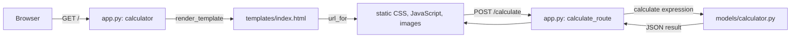

# calc-slang-for-calculator-
Una calculadora hecha con flask
Hola hare mi primer commit 

## How to install and run

First clone the repository and enter the project folder.

```bash
git clone https://github.com/caml07/calc-slang-for-calculator-.git
cd calc-slang-for-calculator-
python -m venv .venv
```

On macOS:

```bash
source .venv/bin/activate
```

On Windows:

```powershell
.venv\Scripts\activate
```

Then install the requirements and run Flask.

```bash
python -m pip install -r requirements.txt
flask --app app run --debug
```

## Model

The Model is in `models/calculator.py`. This is the part that handles the math logic of the calculator, so it stays separate from the interface. The rest of the project only needs to send an expression to:

```python
calculate(expression)
```

The Model supports addition, subtraction, multiplication, division, parentheses, powers, percentages, pi, square root, trigonometric functions in degrees, `log`, and `ln`. It follows the normal order of operations and also supports negative and decimal numbers.

When something cannot be calculated, the Model returns `Math Error`. If the expression is written incorrectly, it returns `Syntax Error`.

The Model tests are in `tests/test_calculator.py`. They check the operations and some invalid expressions so changes can be tested without depending on the interface.

## Views

The View is responsible for the graphical user interface (GUI) of the calculator. Its main purpose is to provide a simple and intuitive way for users to interact with the application. Through the interface, users can enter numerical values, select mathematical operations, and visualize the results generated by the calculator.

The calculator interface includes a display area, where the entered values and calculation results are shown, as well as a set of numeric buttons from 0 to 9. It also provides buttons for the supported mathematical operators, such as addition (+), subtraction (-), multiplication (×), and division (÷). Additional controls, including the equals (=) and clear (C) buttons, allow users to execute calculations or reset the current input.

The View focuses exclusively on the presentation and user interaction aspects of the application. When a user selects numbers or operations through the GUI, the View captures these interactions and communicates the corresponding input to the calculator’s underlying logic. Once the calculation is processed, the resulting value is returned and displayed to the user.

The interface was designed with usability, simplicity, and clarity in mind. The buttons are organized in a familiar calculator layout, allowing users to quickly identify numbers and mathematical operations. This separation between the graphical interface and the calculation logic also contributes to a more organized and maintainable application structure.

## Controller

The Controller is in `app.py`. It creates the Flask application and handles the root route:

```python
@app.route("/")
def calculator():
    return render_template("index.html")
```

When a browser requests `/`, the `calculator` controller renders `templates/index.html`. Flask also serves the view's CSS, JavaScript, and images from `static/` through their `url_for` links. The `calculate_route` controller receives expressions at `POST /calculate`, sends them to `models/calculator.py`, and returns the result as JSON.


